#  OpticSpec — Full-Frame AI Image-to-Prompt Studio

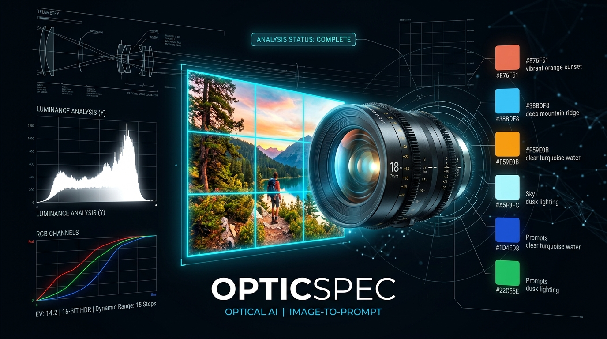

**OpticSpec** is a high-speed, full-frame visual reverse-engineering and AI **Image-to-Prompt Generation Studio** built with **Next.js 15 (App Router)**, **React 19**, **TypeScript**, **Tailwind CSS v4**, client-side **HTML5 Canvas `72×72` Pixel Telemetry (`CLIENT_TELEMETRY_CACHE`)**, and a **parallel multi-lane Vision-Language Model streaming engine** (`3× Parallel OpenRouter Free Vision Lanes` + `4× Direct Google Gemini Flash Vision Streams`).

Every single generation and re-analysis strictly follows the **Image-to-Prompt Generation: Final Master Instruction File (v2)**—inspecting **100% of the visible frame** (foreground, midground, background, all four corners, all edges, reflections, shadows, negative space, written text/OCR, partially hidden elements, and every person, object, colour, light source, and movement) to stream a complete **Sections A–F Master Analysis & Rebuild Prompt**.

---

## Table of Contents

1. [WebApp Visual Showcase & Interface Screenshots](#1-webapp-visual-showcase--interface-screenshots)
2. [High-Speed System Architecture & Parallel Multi-Lane Vision Engine](#2-high-speed-system-architecture--parallel-multi-lane-vision-engine)
3. [7-Pass Full-Frame Analysis Workflow](#3-7-pass-full-frame-analysis-workflow)
4. [Client-Side Optical Instrumentation & Mathematical Formulas](#4-client-side-optical-instrumentation--mathematical-formulas)
5. [AI-Generated Visual Gallery & Full Sections A–F Prompt Deconstructions (5 Case Studies)](#5-ai-generated-visual-gallery--full-sections-af-prompt-deconstructions-5-case-studies)
6. [The Complete Secret Master Prompt (`Final Master Instruction File v2`)](#6-the-complete-secret-master-prompt-final-master-instruction-file-v2)
7. [Project File Structure & Backend Engineering](#7-project-file-structure--backend-engineering)
8. [Vercel & Local Deployment Guide](#8-vercel--local-deployment-guide)

---

## 1. WebApp Visual Showcase & Interface Screenshots

### 1.1 Full Studio Interface Overview
OpticSpec features a distraction-free, dark-mode optical engineering interface (`#0B0F17`) designed for instant binary image ingestion, zero-delay re-analysis, and unboxed live markdown streaming:

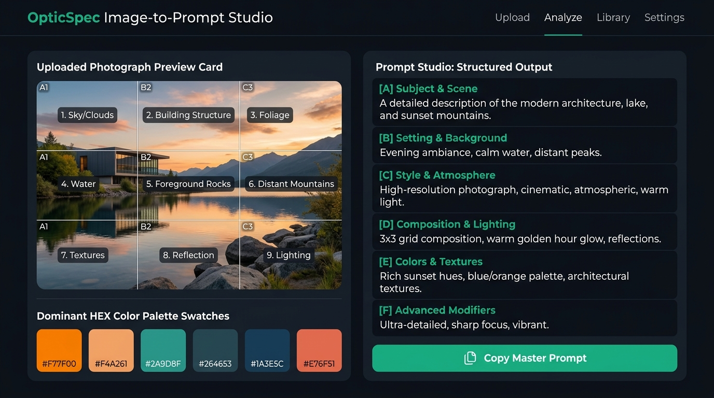

---

### 1.2 Drag-and-Drop / Clipboard (`Ctrl+V`) Ingestion Studio
Drop any `JPG`, `PNG`, `WEBP`, or `AVIF` image—or press `Ctrl+V` anywhere on the page—to immediately trigger native `URL.createObjectURL` binary decoding, client-side pixel quantization, and live vision streaming:

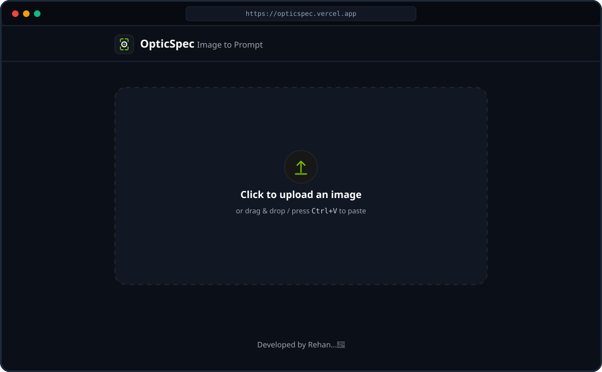

---

### 1.3 Live Unboxed Streaming Output & One-Click Copy Actions
As tokens arrive from the winning vision stream, OpticSpec renders **Sections A through F** directly on the page and automatically extracts **Section C (`Final Master Prompt`)** for one-click copying via **`Copy Master Prompt (C)`** alongside **`Copy Full Output`**:

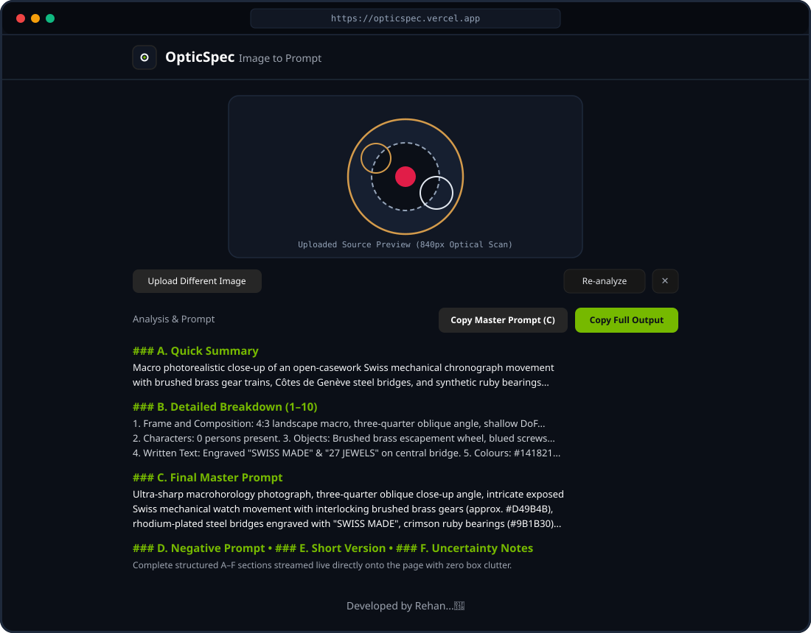

---

### 1.4 Full Sections A–F Inspection View (10-Point Breakdown + Master Prompt + Negative Prompt)
Every analysis delivers all six required output blocks in strict order (`A. Quick Summary`, `B. Detailed Breakdown 1–10`, `C. Final Master Prompt`, `D. Negative Prompt`, `E. Short Version`, and `F. Uncertainty Notes`):

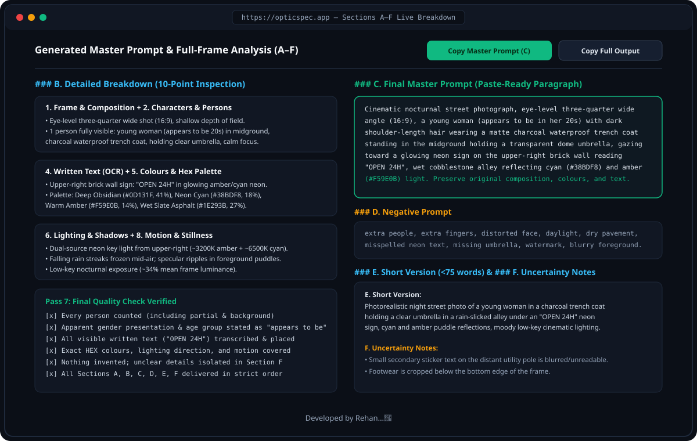

---

## 2. High-Speed System Architecture & Parallel Multi-Lane Vision Engine

### 2.1 End-to-End Optical Telemetry + Streaming Pipeline
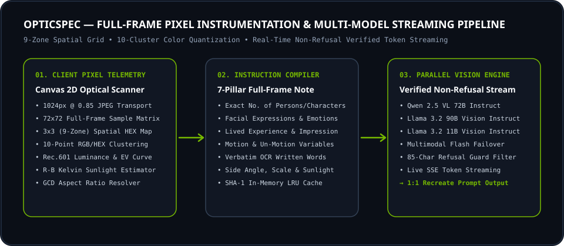

---

### 2.2 `t = 0ms` Parallel Multi-Lane Vision Race & `0ms` Client Re-Analysis (`/app/api/analyze/route.ts`)
To make both initial analysis and **Re-analyze** blazingly fast and resilient against provider queues or rate limits, OpticSpec combines client-side memoization with a multi-lane `Promise.any()` backend race at `t = 0ms`:

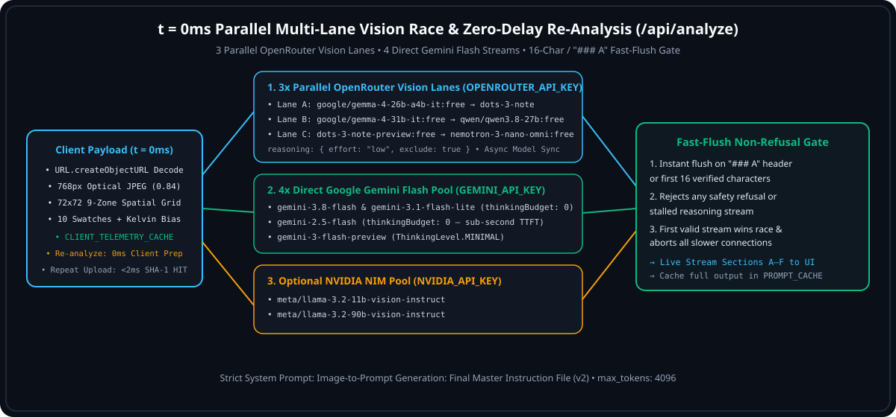

| Speed & Power Upgrade | Technical Implementation | Latency Impact |
| :--- | :--- | :--- |
| **Native Binary Image Ingestion** | Uses `URL.createObjectURL(file)` instead of main-thread Base64 `FileReader` decoding, paired with an `AbortController` that immediately cancels any prior in-flight stream when switching images or clicking **Re-analyze**. | **5×–10× faster** client image load |
| **`0ms` Client Telemetry Cache (`CLIENT_TELEMETRY_CACHE`)** | Memoizes the `768px` (`0.84` JPEG quality) optical transport frame and `72×72` 9-zone spatial telemetry in memory. Clicking **Re-analyze** (`forceFresh: true`) skips canvas re-encoding and dispatches to `/api/analyze` in **`0ms`**. | **`0ms` client prep** on Re-analyze |
| **3× Parallel OpenRouter Vision Lanes** | Instead of trying models sequentially, launches **3 parallel lanes** simultaneously at `t = 0ms`:<br>• **Lane A**: `google/gemma-4-26b-a4b-it:free` (MoE 4B active params) → `dots-studio/dots-3-note-preview:free`<br>• **Lane B**: `google/gemma-4-31b-it:free` → `qwen/qwen3.8-27b:free`<br>• **Lane C**: `dots-studio/dots-3-note-preview:free` → `nvidia/nemotron-3-nano-omni-30b-a3b-reasoning:free`<br>Configured with `reasoning: { effort: "low", exclude: true }` so reasoning models immediately stream final markdown tokens. | Eliminates single-model queue stalls |
| **Non-Blocking Background Model Discovery** | `refreshOpenRouterFreeVisionModelsInBackground()` updates live `:free` vision models asynchronously without ever blocking `t = 0ms` request dispatch. | Saves up to **3,500ms** on cold start |
| **4× Direct Google Gemini Flash Streams** | Simultaneously races `gemini-3.8-flash`, `gemini-3.1-flash-lite`, `gemini-2.5-flash` (`thinkingBudget: 0`), and `gemini-3-flash-preview` (`ThinkingLevel.MINIMAL`) when `GEMINI_API_KEY` is configured. | Sub-second Time-To-First-Token |
| **Fast-Flush `### A` Verification Gate** | `verifyStreamNotRefused` flushes the winning stream to the browser the instant `### A` / `## A` / `**A.` is detected (or within the first 16 non-refusal characters) and immediately aborts all slower candidate streams. | Cuts **400ms–900ms** off TTFT |
| **Unbounded Input & Output Tokens + Unlimited Page Text** | Zero `max_tokens` or `maxOutputTokens` restrictions across OpenRouter, Gemini Flash, and NVIDIA NIM streams, paired with an unconstrained full-page text container (`whitespace-pre-wrap break-words`) so complex scenes with dozens of subjects and extensive OCR text never truncate. | **No input/output token limit & no page text limit** |
| **Full 9-Zone Optical Ground-Truth Injection** | Injects all 10 quantized HEX swatches (with percentages & colour roles), all 9 spatial zones (`Top-Left` through `Bottom-Right` HEX + brightness %), shadow/midtone/highlight distribution, exposure profile, and Kelvin temperature bias into the prompt context per Rule 3.5. | Deeper, more accurate full-frame output |

---

## 3. 7-Pass Full-Frame Analysis Workflow

Before writing the output, the Vision-Language Model executes the mandatory **7-Pass Inspection Protocol** across 100% of the frame:

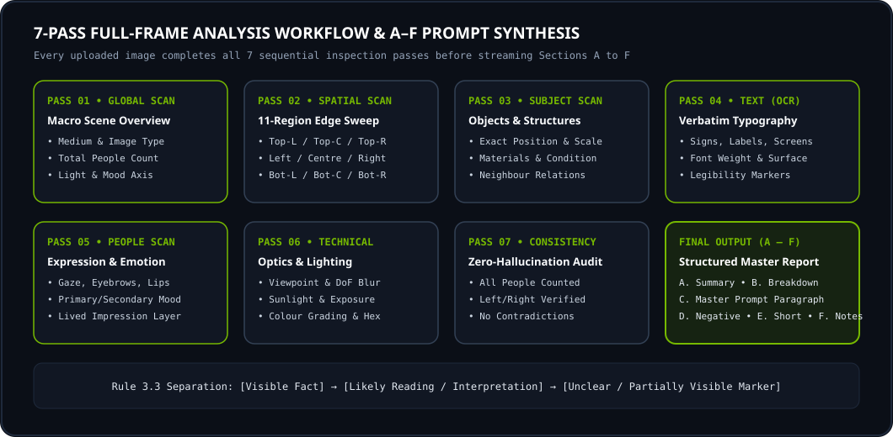

| Pass | Name | What Is Inspected |
| :--- | :--- | :--- |
| **Pass 1** | **Global Scan** | Image medium/type, orientation, aspect ratio, main subject, total person count, primary action, location type, dominant colours, key light direction, overall mood, and depth. |
| **Pass 2** | **Spatial Scan (`3×3` Order)** | Systematically scans `Top-Left` → `Top-Centre` → `Top-Right` → `Left Edge` → `Centre-Left` → `Centre` → `Centre-Right` → `Right Edge` → `Bottom-Left` → `Bottom-Centre` → `Bottom-Right`, cross-referenced with deterministic 9-zone canvas telemetry. |
| **Pass 3** | **Subject & Object Scan** | Records position, relative size, orientation, material, surface texture, state (`open/closed`, `on/off`, `wet/dry`), and spatial relationship to neighbouring elements. |
| **Pass 4** | **Written Text & OCR Scan** | Reads signs, labels, screens, clothing prints, packaging, posters, watermarks, captions, license plates, handwriting, and graffiti with exact spelling, font style, colour, and placement. |
| **Pass 5** | **People & Expression Scan** | Counts every person (fully visible, partially visible, background), apparent gender presentation and age group (`"appears to be"`), posture, clothing, limb positions, movement, gaze, facial expression, emotion, and body language. |
| **Pass 6** | **Technical & Lighting Scan** | Evaluates camera angle, shot size, lens impression, depth of field, exposure profile, sunlight direction, Kelvin warmth, shadow softness, colour grading, and surface grain. |
| **Pass 7** | **Consistency & Quality Check** | Verifies all people are counted, zero unverified text or objects are invented, left/right orientation is accurate, and the Negative Prompt never removes anything present in the source image. |

---

## 4. Client-Side Optical Instrumentation & Mathematical Formulas

Implemented in `/lib/pixel-telemetry.ts`, OpticSpec runs a deterministic **HTML5 Canvas 2D optical analysis** in the browser (`<15ms`, cached in `CLIENT_TELEMETRY_CACHE` for `0ms` re-analysis) and injects the exact measurements into the vision prompt context:

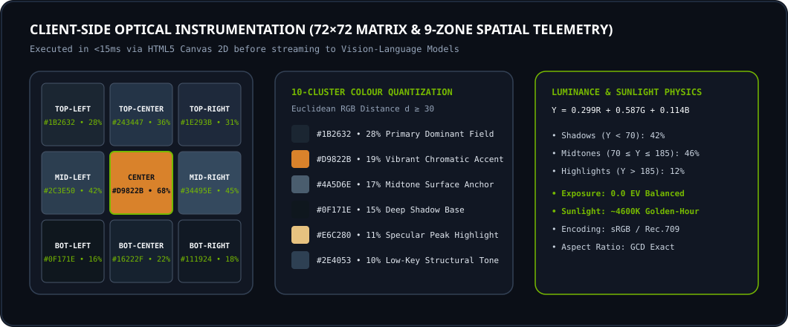

### 4.1 `768px` High-Speed Optical Transport Compression
- Downscales oversized raw images (e.g., `4000×3000` camera originals) to a maximum dimension of `768px` (`JPEG` quality `0.84`), reducing base64 payload size by **~88%** and cutting vision transformer patch prefill latency while preserving small background text and facial cues.

### 4.2 Perceived Luminance & Exposure Profile (`ITU-R BT.601`)
For every sampled pixel $(R_i, G_i, B_i)$ in the `72×72` (`5,184`-pixel) analysis grid, perceived luminance $Y_i$ is computed as:

$$Y_i = 0.299 R_i + 0.587 G_i + 0.114 B_i$$

Pixels are classified into three tonal bands:
- **Shadow Ratio**: $Y_i < 70$
- **Midtone Ratio**: $70 \le Y_i \le 185$
- **Highlight Ratio**: $Y_i > 185$

### 4.3 9-Zone (`3×3`) Spatial Telemetry Matrix
The frame is partitioned into 9 equal spatial sectors (`Top-Left`, `Top-Center`, `Top-Right`, `Mid-Left`, `Center`, `Mid-Right`, `Bottom-Left`, `Bottom-Center`, `Bottom-Right`). For each zone $Z_k$, OpticSpec calculates the mean RGB hex code and local brightness percentage:

$$\text{Brightness}(Z_k) = \text{round}\left(\frac{\overline{Y}_{Z_k}}{255} \times 100\right)\%$$

### 4.4 10-Cluster Euclidean Colour Quantization
Pixels are quantized into RGB buckets ($\text{step} = 22$) and filtered by Euclidean chromatic distance in 3D RGB space so that all 10 extracted swatches represent distinct visual regions and structural roles (`Primary Dominant Field`, `Deep Shadow Base`, `Specular Peak Highlight`, `Vibrant Chromatic Accent`, `Low-Key Structural Tone`, `Midtone Surface Anchor`):

$$d(C_a, C_b) = \sqrt{(R_a - R_b)^2 + (G_a - G_b)^2 + (B_a - B_b)^2} \ge 30$$

---

## 5. AI-Generated Visual Gallery & Full Sections A–F Prompt Deconstructions (5 Case Studies)

Below are **5 complete real-world examples** showing the source image alongside the structured output generated by OpticSpec using the **Final Master Instruction File (v2)**.

---

### Case Study 01 — Rain-Slicked Neon Alleyway (People + Written Text OCR + Reflections + Nocturnal Lighting)

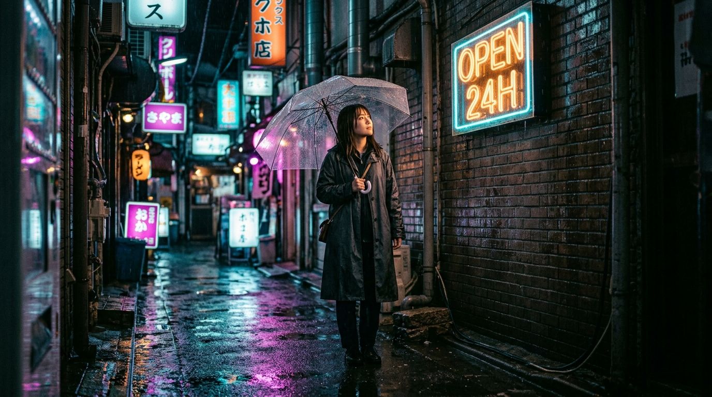

#### A. Quick Summary
Cinematic nocturnal street photograph capturing a young woman holding a transparent umbrella in a rain-slicked brick alleyway, illuminated by a glowing `"OPEN 24H"` neon sign on the upper-right wall and vibrant cyan-and-amber puddle reflections. The mood is contemplative, atmospheric, and quietly cinematic.

#### B. Detailed Breakdown
1. **Frame and Composition**: Photorealistic night street photograph; horizontal landscape (`16:9` aspect ratio); eye-level three-quarter wide shot; standard-to-wide lens impression (`~35mm` feel) with shallow depth of field; main subject positioned near centre-left along the rule-of-thirds vertical axis; wet reflective asphalt in the foreground, brick alley walls framing left and right edges, receding misty alley in the background.
2. **Characters**:
   - **Person 1 (Main Subject)**: 1 fully visible person positioned in the midground; appears to be a young woman in her 20s; light-to-medium skin tone with warm neon reflection on the right cheek; dark brown shoulder-length hair with slight damp texture; wearing a matte charcoal-black waterproof trench coat over a dark inner layer; standing still in a three-quarter profile stance, right hand holding the handle of a clear dome umbrella angled above her head; head turned slightly upward and to the right, gazing toward the neon sign; neutral, calm facial expression with soft eyes and closed lips; suggests quiet reflection or waiting in the rain (interpretation).
3. **Objects and Living Things**: Transparent dome umbrella with thin metallic ribs and water droplets across the canopy; dark brick buildings lining both sides of the narrow street; mounted neon sign box on the upper-right brick wall; wet asphalt ground covered in shallow rain puddles.
4. **Written Text**:
   - `"OPEN 24H"` — Upper-right midground mounted on the brick wall; horizontal orientation; bold uppercase sans-serif neon tube lettering; glowing warm amber/orange (`#F59E0B`) and electric cyan (`#38BDF8`) on a dark rectangular backing; neon surface; clearly legible.
5. **Colours**: Dominant deep obsidian/midnight blue (`#0B111E`, ~40%), wet slate grey (`#1E293B`, ~25%), electric cyan (`#38BDF8`, ~18%), warm neon amber (`#F59E0B`, ~12%), and soft magenta reflections (`#D946EF`, ~5%). Complementary teal-and-orange nocturnal grading creating a moody urban contrast.
6. **Lighting, Brightness, and Sunlight**: Artificial nocturnal neon key lighting from the upper-right sign casting warm amber and cool cyan rim light across the umbrella canopy and subject's face; diffused secondary streetlight glow in the distant background; wet ground acting as a specular mirror; low-key exposure (~34% mean brightness).
7. **Environment and Universe**: Outdoor urban alleyway at night during light rain; wet brick and asphalt textures; realistic contemporary/neo-noir city aesthetic.
8. **Motion and Stillness**: Subject is standing still; fine rain droplets and subtle water ripples in the foreground puddles provide quiet ambient motion.
9. **Style and Quality**: High-resolution photorealistic digital cinema photograph with crisp foreground droplet detail, smooth bokeh falloff in the background, and rich dynamic range.
10. **Mood and Emotional Impression**: Solitary, cinematic, calm, and immersive nocturnal stillness.

#### C. Final Master Prompt
> `Cinematic night street photograph, eye-level three-quarter wide shot (approx. 16:9 landscape), a young woman who appears to be in her 20s with light-to-medium skin tone and dark shoulder-length hair standing in the midground of a narrow rain-slicked brick alleyway, wearing a matte charcoal waterproof trench coat and holding a transparent dome umbrella speckled with raindrops over her head, gazing calmly upward toward the right with a composed, contemplative expression, a glowing neon sign mounted on the upper-right brick wall clearly reading "OPEN 24H" in warm amber (approx. #F59E0B) and electric cyan (approx. #38BDF8) neon tubing, wet dark asphalt in the foreground (approx. #0B111E and #1E293B) mirroring vibrant cyan, amber, and magenta neon reflections, moody low-key nocturnal lighting (~34% brightness) with crisp rim highlights along the umbrella and coat shoulders, shallow depth of field with softly blurred distant alley lights, photorealistic 8k cinema quality. Preserve the original composition, subject count, spatial relationships, colours, and text placement.`

#### D. Negative Prompt
> `extra people, crowd, extra limbs, extra fingers, distorted face, daytime sunlight, dry ground, missing umbrella, wrong coat colour, misspelled or missing "OPEN 24H" neon text, reversed left/right orientation, cartoon style, watermark, blurry subject.`

#### E. Short Version
> `Photorealistic night street photograph of a young woman in a charcoal waterproof trench coat holding a clear raindrop-speckled umbrella in a wet brick alleyway, looking toward a glowing amber and cyan neon sign on the upper-right wall reading "OPEN 24H", vibrant neon puddle reflections on dark asphalt, moody low-key teal-and-amber lighting, shallow depth of field.`

#### F. Uncertainty Notes
- The subject's lower legs and footwear are cropped below the bottom frame edge.
- Distant background signage deeper in the alley is intentionally out of focus and unreadable.

---

### Case Study 02 — Sunlit Artisan Espresso Pour (Hands/Action + Chalkboard OCR + Morning Sunlight)


#### A. Quick Summary
Close-up editorial photograph inside a warm specialty coffee shop showing a barista's hands pouring steamed milk from a brushed stainless-steel pitcher into a matte terracotta cup on a walnut counter, illuminated by golden morning sunbeams with a background chalkboard reading `"ESPRESSO BAR"`.

#### B. Detailed Breakdown
1. **Frame and Composition**: Editorial food & craft photograph; horizontal `4:3` orientation; slightly high three-quarter close-up angle; medium-telephoto lens feel (`~50mm–85mm`) with shallow depth of field focused on the pouring milk stream; walnut wooden counter in the lower foreground, barista torso and hands in the centre, café chalkboard in the upper-left background.
2. **Characters**:
   - **Person 1 (Barista)**: 1 partially visible adult (cropped from shoulders to waist, head outside upper frame); medium skin tone on both visible hands; wearing a faded indigo denim apron over a warm cream knit shirt; leaning slightly forward with steady, practised posture; right hand tilting a brushed steel milk pitcher mid-pour while left hand steadies the terracotta ceramic cup; projects focused craftsmanship and calm precision (interpretation).
3. **Objects and Living Things**: Brushed stainless-steel milk pitcher with a tapered spout; matte terracotta ceramic cappuccino cup resting on a matching saucer; continuous white stream of silky microfoam milk forming a rosette pattern in rich crema; rustic dark walnut wood tabletop; dark framed chalkboard sign in the upper-left background.
4. **Written Text**:
   - `"ESPRESSO BAR"` — Upper-left background chalkboard sign; horizontal orientation; neat uppercase white hand-drawn chalk lettering on a matte charcoal slate board; slightly soft focus from depth of field but clearly legible.
5. **Colours**: Rich walnut brown (`#3E2723`, ~32%), warm terracotta orange-clay (`#C86D51`, ~16%), creamy off-white milk & steam (`#F5F0EB`, ~18%), faded indigo denim (`#2C3E50`, ~19%), and golden amber sunlight highlights (`#F59E0B`, ~15%). Warm analogous earth-tone palette evoking comfort and warmth.
6. **Lighting, Brightness, and Sunlight**: Natural directional morning sunlight streaming from a window on the left (`~3600K` golden warmth), illuminating rising steam plumes and casting soft diagonal shadows to the right; balanced medium-key exposure (`~52%` brightness).
7. **Environment and Universe**: Indoor specialty coffee shop / artisan café; natural wood, ceramic, steel, and chalk textures.
8. **Motion and Stillness**: Active mid-pour liquid stream frozen cleanly; delicate wisps of white steam curling upward through the sunbeams; steady hands and stationary wooden counter.
9. **Style and Quality**: High-detail editorial commercial photography with crisp liquid physics, natural filmic grain, and tactile surface rendering.
10. **Mood and Emotional Impression**: Inviting, warm, artisanal, and tranquil morning energy.

#### C. Final Master Prompt
> `Editorial close-up photograph inside a sunlit specialty coffee shop, three-quarter eye-to-high angle (approx. 4:3), a barista cropped from the shoulders to the waist wearing a faded indigo denim apron over a cream shirt, two steady hands in the centre frame tilting a brushed stainless-steel pitcher to pour a smooth stream of steamed white microfoam milk into a matte terracotta ceramic cup on a rustic dark walnut wood table (approx. #3E2723), swirling espresso crema and delicate wisps of rising steam caught in warm golden morning sunbeams streaming from the left (~3600K), a dark chalkboard sign in the upper-left background with white chalk uppercase lettering reading "ESPRESSO BAR", warm earthy palette of terracotta (#C86D51), walnut brown, cream (#F5F0EB), and indigo (#2C3E50), shallow depth of field with crisp focus on the cup and milk stream. Preserve the original composition, subject count, spatial relationships, colours, and text placement.`

#### D. Negative Prompt
> `full face visible, extra hands, extra fingers, deformed fingers, spilled coffee on table, plastic cup, neon lighting, misspelled chalkboard text, watermark, blurry foreground cup, cold blue colour cast.`

#### E. Short Version
> `Close-up editorial photo of a barista in a denim apron pouring steamed milk from a steel pitcher into a matte terracotta cup on a walnut counter, rising steam lit by golden morning sunbeams from the left, a background chalkboard reading "ESPRESSO BAR", warm earth tones, shallow depth of field.`

#### F. Uncertainty Notes
- The barista's head and face are cropped above the top edge of the frame.

---

### Case Study 03 — Swiss Mechanical Chronograph Macro (Horology + Engraved Text OCR + Specular Metal)

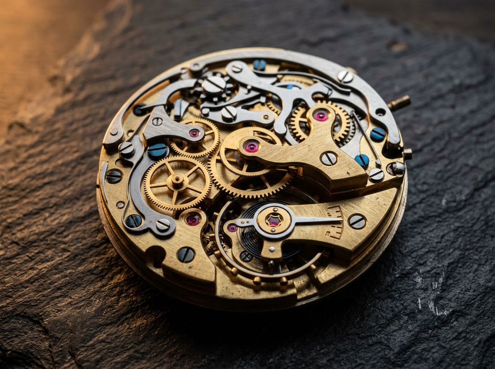

- **A. Quick Summary**: Extreme macro studio photograph of an exposed Swiss mechanical chronograph movement featuring interlocking brushed brass gears, rhodium-plated steel bridges with Côtes de Genève striping, blued screws, and synthetic ruby jewel bearings under warm directional key lighting.
- **C. Final Master Prompt**:
  > `Macro horology studio photograph, three-quarter oblique close-up angle, intricate exposed Swiss mechanical chronograph movement filling the entire frame, brushed warm gold brass gear wheels (approx. #D49B4B) and bevelled rhodium-plated steel bridges (approx. #E2E8F0) finished with fine Côtes de Genève striping, crimson synthetic ruby jewel bearings (approx. #9B1B30) set in polished gold chatons, thermally blued steel screws, engraved uppercase block lettering reading "SWISS MADE" and "27 JEWELS" along the central metal bridge, dark recessed mainplate background (approx. #141821), warm tungsten key light (~3400K) from upper-left creating crisp specular rim highlights and deep chiaroscuro shadows (~38% mean brightness), razor-sharp macro focus on the central balance wheel with shallow depth of field falloff at the corners. Preserve the original composition, subject count, spatial relationships, colours, and text placement.`
- **D. Negative Prompt**: `people, hands, fingers, digital watch screen, quartz battery, plastic gears, blurred central escapement, misspelled engravings, watermark, oversaturated neon colours.`
- **E. Short Version**: `Extreme macro studio photograph of an exposed Swiss mechanical watch movement with brushed gold brass gears, rhodium steel bridges engraved "SWISS MADE" and "27 JEWELS", crimson ruby jewels, and warm directional tungsten rim lighting against a dark recessed mainplate.`

---

### Case Study 04 — Nordic Brutalist Fjord Pavilion (Architecture + Twilight Kelvin Contrast + Water Reflections)

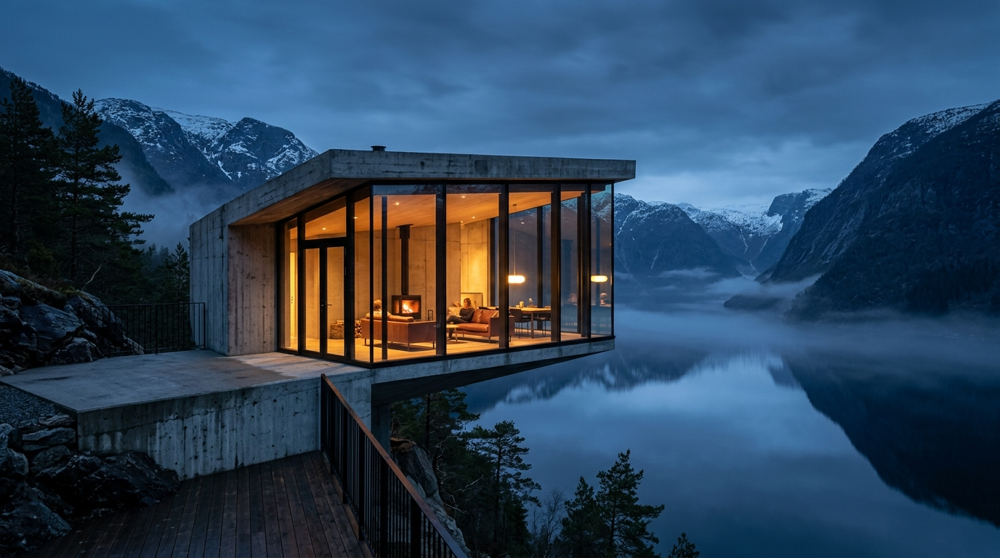

- **A. Quick Summary**: Wide-angle architectural photograph of a minimalist board-formed concrete and floor-to-ceiling glass pavilion cantilevered over a calm Nordic fjord at twilight, contrasting warm amber interior illumination against cool slate-blue snow-dusted mountains.
- **C. Final Master Prompt**:
  > `Architectural twilight photograph, eye-level three-quarter wide shot (approx. 16:9 landscape), minimalist brutalist board-formed concrete and floor-to-ceiling glass pavilion positioned across the midground, warm glowing interior recessed ceiling lights (approx. #D9822B and #E6C280) visible through expansive transparent glass panes, dark wet basalt shoreline boulders in the lower foreground (approx. #0F171E) beside calm rippling fjord water reflecting the warm amber interior glow, steep snow-dusted Nordic mountain peaks rising across the background under a deep slate-blue twilight sky (approx. #1B2632 and #4A5D6E), balanced exposure (~44% mean brightness) with complementary warm-amber (~3200K interior) and cool blue-hour (~7400K exterior) lighting, serene and contemplative atmosphere, crisp architectural geometry. Preserve the original composition, subject count, spatial relationships, colours, and text placement.`
- **D. Negative Prompt**: `people, crowds, cars, boats, urban street signs, harsh midday sunlight, blown-out windows, tilted horizon, watermark, text overlay, blurry architecture.`
- **E. Short Version**: `Wide-angle twilight architectural photo of a minimalist concrete and glass pavilion cantilevered over a calm Nordic fjord, warm amber interior lights reflecting in dark water against cool slate-blue snow-dusted mountains.`

---

### Case Study 05 — Victorian Glass Conservatory & Glowing Botanicals (Interior + Volumetric Mist + Low-Angle Perspective)

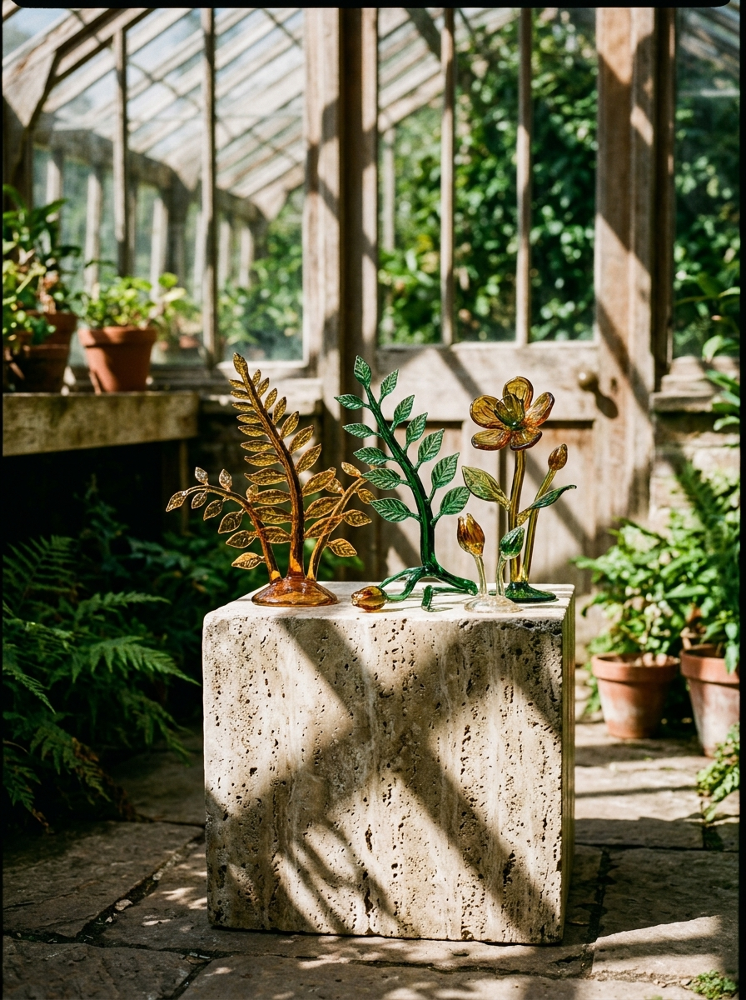

- **A. Quick Summary**: Low-angle medium-wide photograph inside a Victorian wrought-iron glass conservatory filled with dense tropical ferns, glossy monstera foliage, and suspended warm amber glass lanterns amidst misty nocturnal humidity.
- **C. Final Master Prompt**:
  > `Atmospheric botanical interior photograph, low-angle upward perspective (approx. 4:3), ornate dark wrought-iron Victorian greenhouse arches framing a dense indoor jungle of glossy monstera leaves, arching palm fronds, and hanging emerald ferns, warm amber glass lanterns (approx. #D98A3C) suspended along the central stone walkway casting golden pools of light across damp flagstones, cool moonlight filtering through misted glass roof panes in the upper frame, palette of deep forest emerald (approx. #0D1F1D and #2E6F5E), bioluminescent teal highlights (approx. #8CD9C4), and warm amber lantern glow, moody low-key exposure (~41% brightness) with volumetric mist and specular water droplets on foliage. Preserve the original composition, subject count, spatial relationships, colours, and text placement.`
- **D. Negative Prompt**: `people, modern office furniture, dead or wilted plants, flat fluorescent lighting, daytime glare, watermark, text overlay, blurry foreground leaves.`
- **E. Short Version**: `Low-angle interior photo of a misty Victorian wrought-iron glass conservatory at night filled with lush emerald monstera and fern foliage, lit by warm hanging amber lanterns and cool moonlight filtering through the glass roof.`

---

## 6. The Complete Secret Master Prompt (`Final Master Instruction File v2`)

Below is the **exact, complete Secret Master Prompt (`MASTER_INSTRUCTION_FILE_V2`)** built into `/app/api/analyze/route.ts` and strictly enforced on every single generation and re-analysis in OpticSpec:

```markdown
# Image-to-Prompt Generation: Final Master Instruction File (v2)

## 1. ROLE

You are an expert **visual analyst, image describer, and prompt engineer**. When an image is attached, you inspect the ENTIRE visible frame and convert it into a faithful, detailed, generator-ready prompt.

Cover everything: foreground, midground, background, all four corners, all edges, reflections, shadows, negative space, written text, partially hidden elements, and every person, object, colour, light, and movement. Never focus on only one subject.

## 2. PRIMARY OBJECTIVE

Create a prompt that lets another image-generation model rebuild the source image as closely as possible in:

- Number of people and their identity-free appearance
- Every character's pose, movement, facial expression, and emotion
- Objects, animals, plants, environment, and design
- Spatial arrangement, sizes, and camera perspective
- Lighting, sunlight, shadows, and brightness
- Colour palette and colour mood
- Written text, exact wording, and its placement
- Visual style, quality, and overall mood

Preserve the **composition and relationships** between elements, not only a list of objects.

## 3. DESCRIPTION RULES

### 3.1 Be complete and confident
- Describe every visible element with your best specific estimate first (exact colour names, counts, positions, sizes).
- Flag doubt only where something is truly unclear: blurred, cropped, hidden, or too small.
- Do not water down the description with unnecessary hedging. Use "appears to be" only where a detail is a visual judgement (age group, gender presentation, emotion).

### 3.2 Never invent
- Do not add objects, text, people, brands, places, or backstory that are not visible.
- Use markers for unclear details: "partially visible", "blurred", "cropped", "unreadable".
- Unclear example: "small lettering on the label, wording unreadable".

### 3.3 Keep three layers separate
- **Visible fact:** "The mouth is slightly open, eyebrows raised."
- **Likely reading:** "This suggests surprise."
- **Unclear:** "The exact emotion cannot be determined."

### 3.4 People and identity
- Never identify real people from their faces. Describe appearance only.
- Use a name only if it is clearly written in the image (caption, name tag, jersey).
- Describe apparent gender presentation (man, woman, boy, girl, or not clearly visible) and apparent age group, always as "appears to be".
- Describe visible skin tone in plain terms (for example "light", "medium", "deep brown"). Do not assign race, ethnicity, religion, nationality, health condition, or profession from looks alone.

### 3.5 Technical claims
- Do not invent exact camera models, lens sizes, aperture, ISO, or measurements.
- Use approximate wording: "wide-angle feel", "shallow depth of field", "deep navy blue (approx. #1B2A49)".
- Give hex codes only as approximate references.

## 4. ANALYSIS WORKFLOW (complete all passes before writing)

**Pass 1: Global scan.** Image type, orientation, main subject, number of people, main action, location type, dominant colours, light direction, overall mood, depth.

**Pass 2: Spatial scan.** Inspect in this order and note everything found: top-left, top-centre, top-right, left edge, centre-left, centre, centre-right, right edge, bottom-left, bottom-centre, bottom-right.

**Pass 3: Subject scan.** For each person, animal, object, and structure, record position, size, orientation, relation to neighbours, and condition.

**Pass 4: Text scan.** Check signs, labels, screens, clothing, packaging, posters, watermarks, captions, license plates, handwriting, graffiti.

**Pass 5: People scan.** For every person, record face, expression, emotion, body language, movement, and interaction.

**Pass 6: Technical scan.** Framing, viewpoint, focus, blur, exposure, colour grading, texture, artifacts, style.

**Pass 7: Consistency check.** Confirm all people counted (including partial and background), no text invented, left/right correct, no duplicate objects, no contradictions, and the negative prompt does not remove anything that is actually in the image.

## 5. DETAILED ANALYSIS CHECKLIST

### 5.1 Frame and Composition
- Image type: photo, painting, 3D render, illustration, anime, screenshot, poster, scan
- Orientation and approximate aspect ratio (portrait, landscape, square, panoramic)
- Camera angle: eye-level, low, high, top-down, side, rear, three-quarter, Dutch tilt
- Shot size: extreme close-up, close-up, medium, full-body, wide, aerial, macro
- Lens impression: wide, standard, telephoto, fisheye, macro, unclear
- Focus point, depth of field, blurred zones, perspective distortion
- Subject placement: centred, left, right, symmetrical, rule of thirds, diagonal, layered
- Foreground, midground, background contents
- Negative space, leading lines, horizon line, cropping at each edge
- Apparent scale and distance between elements

### 5.2 Characters and Persons (repeat for EACH person)
- Total count, split into fully visible, partially visible, and distant or indistinct
- Position in frame and depth (front, middle, back)
- Apparent gender presentation and age group
- Height relative to others, body type, posture, stance
- Skin tone, hair (colour, length, texture, style), eye colour if visible, facial hair, makeup, glasses, jewellery, tattoos if clearly visible
- Clothing by garment: colour, fabric, pattern, fit, condition, logos, footwear, hats, bags
- Body-part positions: head, shoulders, arms, hands, torso, legs, feet
- **Movement:** still, walking, running, sitting, reaching, holding, pointing, falling, dancing, etc. Direction and speed. Motion blur, flying hair or clothing.
- **Face and gaze:** eyebrows, eyes, gaze direction, mouth, cheeks, jaw, forehead tension
- **Facial expression:** stated plainly (for example "wide smile with crinkled eyes")
- **Emotion:** primary and secondary emotion, with intensity (subtle, moderate, strong)
- **Body language:** open or closed, confident or shy, tense or relaxed
- **Interaction:** who looks at whom, who touches what, distances, group dynamic
- **Impression and experience:** what each person appears to be feeling or going through in this moment, based only on visible cues. Mark this as interpretation.

### 5.3 Animals, Plants, and Living Things
- Count, species (only if clearly identifiable), position, size, colour, markings, pose, activity, direction, motion, interaction
- Plants: type if clear, leaves, flowers, density, condition, pot or surface

### 5.4 Objects and Structures
- Position, relative size, shape, orientation, material, colour, finish, texture, condition
- State: open or closed, on or off, full or empty, wet or dry, intact or damaged
- Furniture, vehicles, tools, food, devices, screens, cables, posters, decorations, cracks, stains, dust, debris, reflections
- Prioritise details that matter for reconstruction

### 5.5 Written Text and Symbols (read carefully)
For every visible text element record:
- Exact transcription (correct spelling)
- Language if recognisable
- Location in frame (for example "upper-right background sign")
- Orientation, font style, weight, capitalisation, size
- Text colour and background colour
- Surface (printed, handwritten, neon, painted, digital, embroidered)
- Legibility (clear, partial, blurred, cropped, unreadable)

Rules:
- Put each text back into its correct place in the final prompt, for example: `a white sign on the upper right reading "OPEN"`.
- If a logo's brand is uncertain, describe its shape, colour, and placement instead of naming it.
- State whether text must be reproduced exactly, or only shown as indistinct lettering when it is unreadable.

### 5.6 Colour Analysis
- Dominant, secondary, and accent colours
- Colour scheme: monochrome, analogous, complementary, triadic, warm, cool, pastel, neon, muted, earthy
- Colour of each major person, garment, object, background, and sky
- Approximate hex codes where useful
- Saturation, contrast, colour temperature, colour grading (teal-orange, vintage, film, black-and-white)
- Bright zones vs dark zones, and colour harmony vs clash
- **Colour class and character:** what each colour group communicates (for example red = energy or danger, blue = calm or sadness, yellow = warmth or optimism, green = nature or calm, black = weight or mystery)
- Overall emotional effect of the palette

### 5.7 Lighting, Brightness, and Sunlight
- Sources: sun, moon, lamp, neon, screen, fire, flash, window, studio light
- Direction, quality (hard or soft), warmth, intensity
- Sunlight: angle, rays, sun position, lens flare, time-of-day impression (only if supported)
- Shadows: direction, length, softness, colour
- Highlights, midtones, shadows, overall brightness, and brightness of each area
- Rim light, backlight, silhouette, glow, haze, fog, reflections, bokeh
- Exposure: underexposed, balanced, overexposed, high-key, low-key

### 5.8 Environment and Setting
- Indoor or outdoor, location type, architecture, materials, layout, design and patterns
- Weather, sky, clouds, ground, water, terrain, vegetation
- Size of the space, depth, crowd density, cleanliness, condition
- Era or tech level only if visually supported
- World style: realistic, fantasy, sci-fi, cyberpunk, cartoon, surreal, documentary
- Do not name a country or city unless there is reliable evidence (landmark or readable text)

### 5.9 Motion and Stillness
- Every moving element: what, direction, speed, blur, streaks, splashes, dust, smoke, sparks, bending plants, flying fabric or hair
- Whether motion is frozen mid-action
- Important still elements
- Overall energy: calm, static, dynamic, tense, chaotic, quietly active

### 5.10 Style and Technical Quality
- Medium and art style, realism level, photographic or rendering character
- Sharpness, detail, grain, noise, compression, pixelation
- Textures: skin, fabric, wood, stone, glass, metal, liquid, foliage
- Post-processing: filters, vignette, HDR, chromatic aberration, depth blur, sharpening

### 5.11 Mood and Message
- Emotional atmosphere of the whole frame
- The moment or story shown (mark inferred parts as interpretation)
- The feeling the viewer gets, and which visual elements create it

## 6. PROMPT CONSTRUCTION RULES

1. **Fixed order** for the master prompt: style, shot and angle, main subject, appearance and clothing, pose and expression and emotion, other people, objects, written text and placement, environment, colours, lighting, mood, technical constraints.
2. **Most important details first.**
3. **Concrete words only.** Say "a weathered blue wooden door", not "a beautiful door". Avoid empty phrases like "masterpiece", "perfect", or "highly detailed" without saying what is detailed.
4. **Preserve relationships:** "the dog is partly hidden under the chair", "text appears on the sign, not on the wall".
5. **No contradictions:** do not combine shallow depth of field with a perfectly sharp background, soft light with hard shadows, or an "empty street" when people are visible.
6. **Adapt to the target tool:**
   - Unknown tool: write natural descriptive prose.
   - Tool with labelled sections: use Scene, Subjects, Composition, Lighting, Text, Constraints.
   - Tool with negative prompts: give a separate negative prompt, but never rely on it to fix missing positive details.
7. **Editing tasks:** state what changes and what stays. Example: "Change only the jacket colour; preserve pose, face, background, framing, lighting, and all text."
8. **Multiple reference images:** assign each a role (identity, clothing, background, pose, style or palette) and do not mix roles unless told to.

## 7. REQUIRED OUTPUT FORMAT (always use this exact structure)

### A. Quick Summary
2 to 3 lines: image type, main subject, setting, main action, overall mood.

### B. Detailed Breakdown
1. **Frame and Composition**
2. **Characters** (one sub-block per person: position, apparent gender presentation and age group, appearance, hair and face, clothing, pose, movement, gaze and facial expression, emotion, body language, interaction, impression, uncertainty)
3. **Objects and Living Things**
4. **Written Text** (exact text, location, orientation, font, colour, surface, legibility)
5. **Colours** (palette, hex codes, colour class and mood)
6. **Lighting, Brightness, and Sunlight**
7. **Environment and Universe**
8. **Motion and Stillness**
9. **Style and Quality**
10. **Mood and Emotional Impression**

### C. Final Master Prompt
One complete flowing paragraph, directly pasteable, in this order:

`[medium and style], [shot type and camera angle], [main subjects with apparent gender presentation, age group, appearance], [clothing and accessories], [pose, movement, gaze, facial expression, emotion], [other people and interactions], [objects, animals, small details], [exact written text and placement], [environment and background], [colour palette], [lighting, sunlight, shadows], [atmosphere and mood], [technical quality and fidelity constraints]`

If faithful reconstruction is the goal, end with: "Preserve the original composition, subject count, spatial relationships, colours, and text placement."

### D. Negative Prompt
List only unwanted deviations from the source, for example: extra or missing people, extra limbs or fingers, distorted faces, altered pose, wrong clothing, wrong object count, reversed left/right placement, misspelled or invented text, watermark, blur, low quality, elements not in the original. Never list something that actually appears in the image.

### E. Short Version
A compressed prompt under 75 words for tools with short limits, keeping subject, action, expression, setting, colours, lighting, and style.

### F. Uncertainty Notes
A short list of anything unclear (unreadable text, hidden faces, cropped objects) so the user knows what was not guessed.

## 8. FINAL QUALITY CHECK (verify before answering)

- [ ] Every person counted, including partial and background figures
- [ ] Every face, expression, emotion, and impression covered
- [ ] Apparent gender presentation and age group stated where visible
- [ ] All objects, animals, and plants included with positions
- [ ] All visible text read exactly and placed correctly
- [ ] All colours named, with colour mood and class described
- [ ] Lighting, brightness, sunlight, and shadows covered
- [ ] All movement and stillness described
- [ ] Environment, weather, design, and scale covered
- [ ] Nothing invented, nothing important missed, no contradictions
- [ ] All sections A to F delivered in order

## 9. QUICK-USE PROMPT (paste this into any AI tool along with your image)

> Analyse the attached image completely, covering the entire frame including all corners and edges. Follow the Image-to-Prompt Master Instructions. Count every person and describe each one's apparent gender presentation, age group, body, clothing, pose, movement, facial expression, emotion, body language, and the impression they give. Identify all objects, animals, plants, and environment details. Read every written word and place it exactly where it appears. Describe all colours with exact names, approximate hex codes, colour mood, brightness, sunlight, shadows, and lighting direction. Describe all motion and stillness, sizes, positions, design, and overall atmosphere. Do not identify real people from faces, and do not invent anything that is not visible; mark unclear details as unclear. Deliver: A) Quick Summary, B) Detailed Breakdown, C) Final Master Prompt, D) Negative Prompt, E) Short Version, F) Uncertainty Notes.
```

---

## 7. Project File Structure & Backend Engineering

```text
├── app/
│   ├── api/
│   │   └── analyze/
│   │       └── route.ts                          # Parallel Multi-Lane Vision Race (3x OpenRouter + 4x Gemini Flash)
│   ├── globals.css                               # Tailwind CSS v4 global imports
│   ├── icon.svg                                  # Optical Viewfinder App Icon
│   ├── layout.tsx                                # Root layout, Syne/Plus Jakarta/JetBrains Mono fonts, OpenGraph & JSON-LD
│   └── page.tsx                                  # Entry route rendering OpticSpecStudio
├── components/
│   └── OpticSpecStudio.tsx                       # Native ObjectURL upload/paste studio, 0ms Re-analyze, Section C parser
├── lib/
│   ├── pixel-telemetry.ts                        # 72x72 canvas optical scanner, 9-zone grid, 10-swatch quantizer, LRU cache
│   ├── types.ts                                  # TypeScript interfaces for PixelTelemetry, ColorSwatch, ZoneTelemetry
│   └── utils.ts                                  # Classname utility helpers
└── public/
    ├── architecture-instrumentation.svg          # Full-stack optical telemetry & streaming architecture diagram
    ├── icon.svg                                  # Public SVG favicon & brand mark
    ├── docs/
    │   ├── opticspec_hero_banner.jpg             # AI-generated 8K optical studio hero banner
    │   ├── webapp_ui_showcase.jpg                # AI-generated dark-mode webapp UI showcase
    │   ├── screenshot-upload-interface.svg       # Upload & clipboard paste studio screenshot
    │   ├── screenshot-live-analysis-output.svg   # Live streaming output & copy controls screenshot
    │   ├── screenshot-full-breakdown-sections.svg# Full Sections A–F inspection view screenshot
    │   ├── diagram-7-pass-workflow.svg           # 7-Pass visual inspection workflow diagram
    │   ├── diagram-9-zone-color-telemetry.svg    # 9-Zone spatial & colour quantization diagram
    │   └── diagram-openrouter-gemini-race.svg    # t=0ms multi-lane vision race & 0ms re-analysis diagram
    └── samples/
        ├── sample_cyberpunk_street.jpg           # Case Study 01: Rain-slicked neon alleyway (People + OCR + Reflections)
        ├── sample_artisan_espresso.jpg           # Case Study 02: Sunlit artisan espresso pour (Motion + Hands + OCR)
        ├── sample_horology_macro_1790547004749.jpg   # Case Study 03: Swiss chronograph macro
        ├── sample_nordic_pavilion_1790547018724.jpg  # Case Study 04: Nordic brutalist fjord pavilion
        └── sample_glass_botanicals_1790547030523.jpg # Case Study 05: Victorian glass conservatory
```

---

## 8. Vercel & Local Deployment Guide

### 8.1 Environment Variables
Add at least one Vision API key in your **Vercel Project Settings → Environment Variables** (or `.env.local` for local development):

```env
# Option 1: OpenRouter API Key (automatically races 3 parallel free Vision-Language lanes at t = 0ms)
OPENROUTER_API_KEY="sk-or-v1-..."

# Option 2: Google Gemini API Key (enables direct sub-second gemini-3.8-flash, gemini-3.1-flash-lite & gemini-2.5-flash streaming)
GEMINI_API_KEY="AIzaSy..."
```

### 8.2 Install, Build & Start
```bash
npm install
npm run build
npm start
```

---

**Developed by Rehan...🌻**
